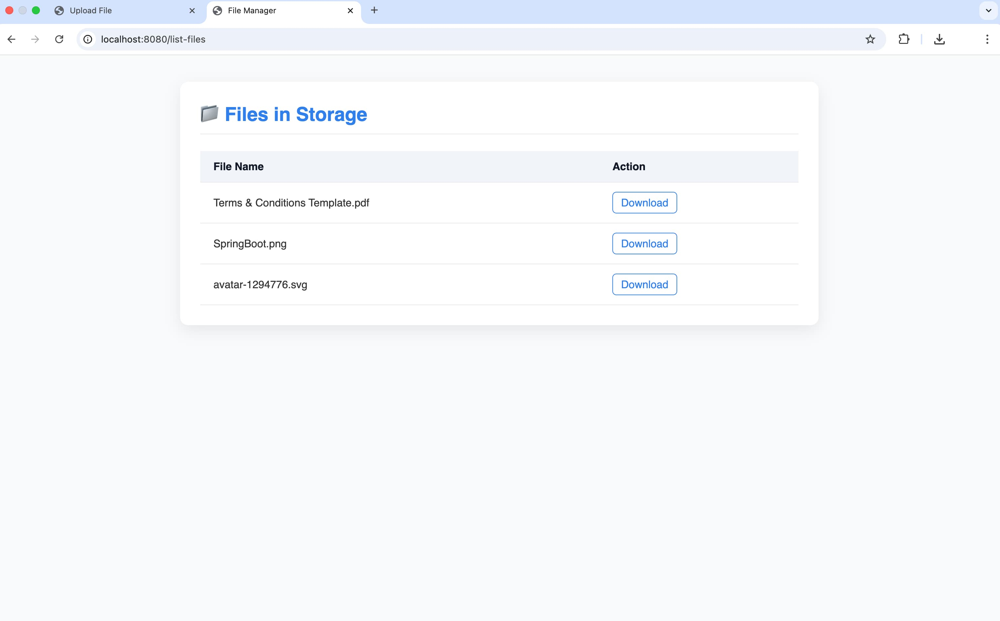

<h1 align="center">📂 SpringBoot File Manager</h1>

  A robust and scalable file management REST API developed with Spring Boot.
Seamlessly handle file uploads, retrievals, and downloads with high performance and reliability.

  
  
  

## 🚀 Features

- ✅ Upload any file via REST API
- 📄 List all uploaded files
- 📥 Download individual files by filename
- 💾 Store files
- 🧱 Built with clean, modular Spring Boot architecture

## 🛠️ Tech Stack

- Java 21
- Spring Boot 3.5
- REST APIs
- Maven

## 📸 Demo Screenshot

  <h3>File Upload</h3>
  
  
  <h3>List of Files</h3>
  

